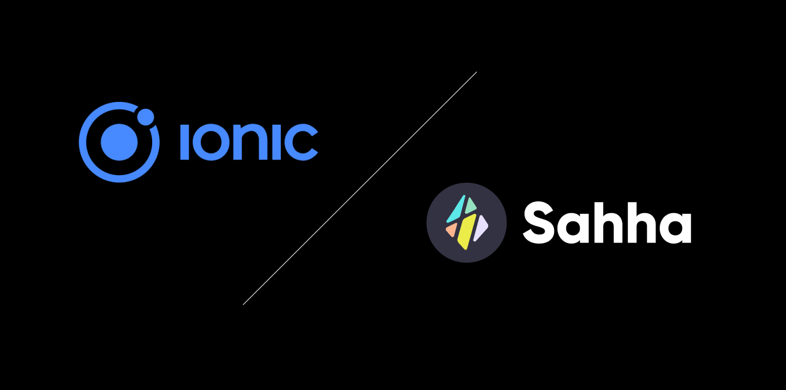

import SubscribeButton from '@site/src/components/blog/subscribe';

---

*Sahha SDK now supports Ionic / Capacitor*

<!--truncate-->

Sahha has released SDK support for Ionic and Capacitor cross-platform apps.

The project is available through Github and Node Package Manager.

Documentation and tutorials on how to use Sahha with Ionic is available on our [developer documentation portal](https://developer.sahha.ai).

As we do for all SDK’s we provide a simple demo application that is [available for download here](https://github.com/sahha-ai/sahha-demo-ionic).

Enjoy!

---

<SubscribeButton />