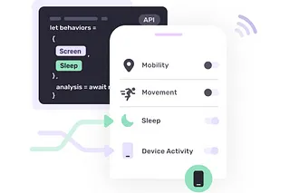

import SubscribeButton from '@site/src/components/blog/subscribe';

---

*How today's digital health app users perceive value*

<!--truncate-->

An effective mobile app is easy to understand, quick to onboard, and fun to use. Put another way, with little to no work from the user, the app delivers the value one expects time and time again.

The mobile app landscape is littered with health and wellbeing products failing to gain and retain users because they miss one or more of the aforementioned criteria above. Often, the value proposition is compelling, but the user is required to perform too much (and sometimes anything more than nothing is too much) work within the app to receive the anticipated value.

Given that “value” is subjective, it is the user’s perception, not the creating company’s, that is the most important opinion when assessing value. As a general rule of thumb, the more work a user needs to do to receive expected value, whether it is during initial sign up or on an ongoing basis, the lower the perceived value of that app will be.

One of the ways that mobile apps require work from their users is by prompting them to enter data, to tell the app something, so that the app can return the value in whatever form that takes (e.g. interventions, recommendations, education). Despite knowing a benefit awaits them, users are tired of being asked information or inputting information, so the perceived value falls, with retention and engagement soon following.

Two examples of digital health apps that reduce the work their users do are Fitbit and MyFitnessPal. At the time of their inceptions, both apps placed heavy burdens on their users to input data. The more a user gave, the more they received. Over time, the apps began to leverage technology and data to track fitness, nutrition, and other elements automatically. This shift continues today with both apps continuing to enjoy healthy acquisition and retention metrics.

Digital health mobile apps with the highest perceived value require the fewest user inputs and ask for the least amount of user effort.

How can health apps reduce user “work” so their perceived value increases? The solution is often outside of the bounds of what we consider standard procedure while engineering apps.

Fitbit used behavioral signals from their devices to transmit data that would otherwise be manually entered into forms, and MyFitnessPal utilized barcode scanning technology to capture nutrition information from food labels so the user didn’t have to search and then store this information manually. Both apps turned to new technology (at the time) in order to solve the “user work” problem.

New technologies like AI/ML are now accessible to most developers through simple to integrate API’s and health data can be captured by means other than user-driven forms by readily available open API’s from device manufacturers such as Apple or Android. There is swiftly becoming less reasons to ask users for the data needed to deliver value to them, so long as their permission is granted to capture it, and thanks to modern approaches to putting data sharing and privacy control in the hands of users approaches like this are becoming more frequently used by modern app developers.

Data without forms, and answers without questions is an easier proposition than one would think when it comes to creating the future of digital health.

---

<SubscribeButton />