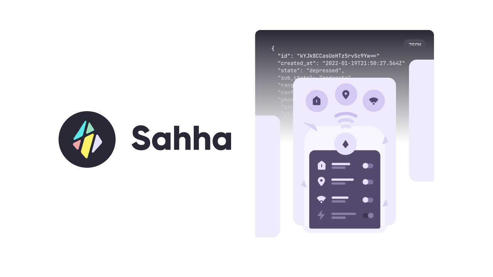

import SubscribeButton from '@site/src/components/blog/subscribe';

---

*‘Data sharing’ within health care broadly involves collecting data from a collective and making it available across different agencies. Why is it important for the future and what do users think?*

<!--truncate-->

## What is ‘Data sharing’ within health care?

‘Data sharing’ within health care broadly involves collecting data from a collective and making it available across different agencies such as the different healthcare services, research-academic purposes, or for industry work (Hulsen, 2020). Information collected passively through mobile phones and wearables can provide the individual, health-care services, insurers, and other organisations with the immediate information about an individual’s physical and mental health.

We (at Sahha) are looking to promote mental health and well-being through APIs, and so, our focus at this stage is to 1) collect behavioural data from an individual’s mobile phone; and to 2) inform the user of the potential risk factors of developing mental health issues. The premise of our goal revolves around behavioural data collection which relies on the user’s willingness to share their data. However, there are concerns surrounding data sharing that prevents an individual from sharing their personal data. In this paper we will explore the 1) current attitudes toward data sharing; 2) some of the common concerns that leads to user non-compliance to digital data sharing; and 3) ways to increase willingness to digital data sharing.

SAHHA.AI
JUN 10, 2022
What is ‘Data sharing’ within health care?
‘Data sharing’ within health care broadly involves collecting data from a collective and making it available across different agencies such as the different healthcare services, research-academic purposes, or for industry work (Hulsen, 2020). Information collected passively through mobile phones and wearables can provide the individual, health-care services, insurers, and other organisations with the immediate information about an individual’s physical and mental health.

We (at Sahha) are looking to promote mental health and well-being through APIs, and so, our focus at this stage is to 1) collect behavioural data from an individual’s mobile phone; and to 2) inform the user of the potential risk factors of developing mental health issues. The premise of our goal revolves around behavioural data collection which relies on the user’s willingness to share their data. However, there are concerns surrounding data sharing that prevents an individual from sharing their personal data. In this paper we will explore the 1) current attitudes toward data sharing; 2) some of the common concerns that leads to user non-compliance to digital data sharing; and 3) ways to increase willingness to digital data sharing.

## Current Attitudes towards Data Sharing in Healthcare
Since the mobile health applications (mHealth) seems to be a promising field in providing healthcare support to all individuals with a mobile phone (Messner et al., 2019), the current data sharing attitudes of all mobile phone users should be evaluated. Since different populations may have different attitudes about health data sharing due to a variety of reasons (e.g. different health status), we have separated the attitudes by their demographic personas.

### General Patients
Aggarwal et al. (2020) found that individuals with lower educational attainment were less likely to data share with the National Health Services compared to the Caucasian group and individuals that owned a smartphone. It was also found that individuals were less likely to data share with third party organisations such as insurance companies, news organisations, and technology companies even if the data was anonymised because they believed that the third part organization would profit from their information. Broadly, it was also found that the minority groups (Black, Asian, and Minority Ethnic) in the UK were less likely to be comfortable sharing their health data for artificial intelligence (AI) research.

### Mental Health Patients
Di Matteo et al. (2018) found that about 89% of the participants in their sample owned a smart phone and used internet on a daily-basis. 41% of the participants stated that they would be willing to download an app that collects their mental health data and an additional 43% would be willing if they were provided details about the functionality of the app. Further, it was found that participants were more likely to allow data sharing for screen on-off information (68%), motion sensors (53%), GPS location (54%), calendar information (52%) than for audio-related information and text-messages.

### Millennials
Murphy et al.,(2021) found that millennial participants wanted to be able to control the type of location data to share such as sharing their location with ambulance services but they also wanted an option to opt-out, should they want to. Further, it was found that if individuals were made aware of how their location data will be used by health services, they were more likely to share their data. Participants also expressed that anonymising the data would minimise risk and increase trust in the services. Participants also expressed concerns surrounding risks associated storing and protecting their data. Lastly, some participants also suggested that location data sharing may increase distrust in the government.

### Older-Adults
Seifert, Christen, & Martin (2018) found that older-adults that were interested in new technology, had poor health, and those that exercised regularly were those that were more likely to track their health information on their mobile devices. About 49% of all older-adult participants and 58% of older-adult participants that tracked their health information were more willing to share their health information with academic researchers rather than with third party organisations such as insurance companies. Interestingly, it was also found that individuals that were wealthy were more likely to share their health data.

## Reasons behind user non-compliance to digital data sharing
Based on the studies mentioned above, the reasons behind user non-compliance stem from four basic user concerns: privacy, trust, control, and lack of awareness. Users are less likely to comply if their health data is used for the profit of a third-party organization and/or if their anonymized data can be de-anonymized (Aggarwal et al., 2020). Users lacked trust in organizations if they felt constantly under surveillance if they were data sharing, making them less willing to share (Murphy et al., 2021). Users were less likely to share personal information that they thought would portray them negatively exposing them to judgement and scrutiny by the researcher or other personals involved (Di Matteo et al., 2018). Users were more willing to data share if they had perceived control over the data they were sharing and if there was an option to ‘opt-out’, should they want to (Murphy et al., 2021). Users were also more willing to share if they were made aware about who has access to their health data and the purpose of data collection (Kim et al., 20015; Aggarwal et al., 2020; Murphy et al., 2021; Jaana & Paré, 2020).

## How to increase user willingness *to share?*
Since most users lacked knowledge about AI research and mobile phone data sharing, increasing user awareness about the principles of AI and ML research and how collecting their behavioural health data (Aggarwal et al., 2020) would contribute to 1) their well-being and 2) the well-being of the wider-population. Additionally, users should also be made aware of how their information is being used, with additional emphasis placed on the privacy and confidentiality issues (Murphy et al., 2021; Kim et al., 2015; Jaana & Paré, 2020). where applicable, users should be reassured that their data is deanonymized and processed by automated statistical model, and only very rarely is all of their information available to an individual (Murphy et al., 2021; Di Matteo et al., 2018). Users should not be concerned about scrutiny by anyone involved in the data analysis process.

While this paper focuses on the attitudes of different groups of people on data sharing, it is important to remember that participants were simply asked about their willingness to share in most of the studies described in this paper. For the most part, participants’ actual behaviour towards data sharing was not measured. Their attitudes about data sharing may not tell us a lot about their actual behaviours but may be a good indicator of it. In any case, increasing awareness about technological advances made in AI and ML research could a) increase user-willingness; b) provide the users more information about how they can benefit from the technological advancements.

---

## References

Aggarwal, R., Farag, S., Martin, G., Ashrafian, H., & Darzi, A. (2021). Patient Perceptions on Data Sharing and Applying Artificial Intelligence to Health Care Data: Cross-sectional Survey. Journal of medical Internet research, 23(8), e26162.

Di Matteo, D., Fine, A., Fotinos, K., Rose, J., & Katzman, M. (2018). Patient willingness to consent to mobile phone data collection for mental health apps: structured questionnaire. JMIR mental health, 5(3), e9539.

Hulsen, T. (2020). Sharing is caring—data sharing initiatives in healthcare. International Journal of Environmental Research and Public Health, 17(9), 3046.

Jaana, M., & Paré, G. (2020). Comparison of mobile health technology use for Self-Tracking between older adults and the general adult population in Canada: cross-sectional survey. JMIR mHealth and uHealth, 8(11), e24718.

Kim, K. K., Joseph, J. G., & Ohno-Machado, L. (2015). Comparison of consumers’ views on electronic data sharing for healthcare and research. Journal of the American Medical Informatics Association, *22(*4), 821-830.

Murphy, H., Keahey, L., Bennett, E., Drake, A., Brooks, S. K., & Rubin, G. J. (2021). Millennial attitudes towards sharing mobile phone location data with health agencies: a qualitative study. Information, Communication & Society, 24(15), 2244-2257.

Seifert, A., Christen, M., & Martin, M. (2018). Willingness of older adults to share mobile health data with researchers. GeroPsych.

---

<SubscribeButton />