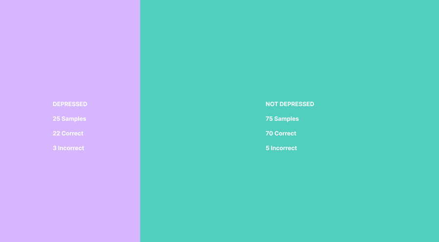
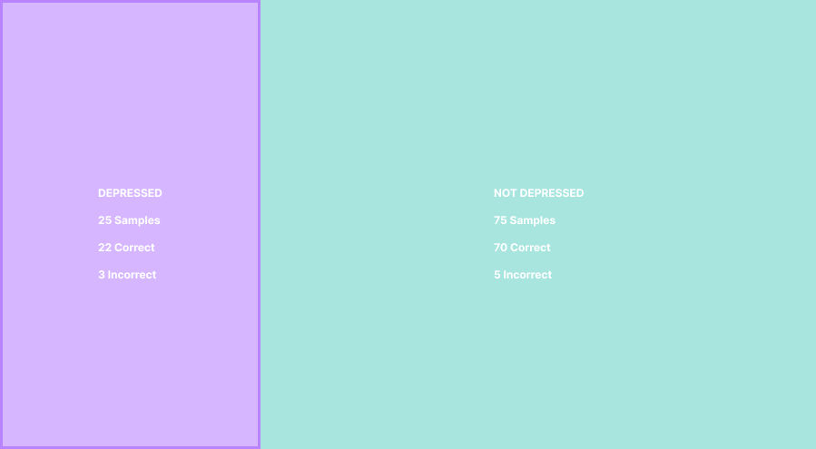
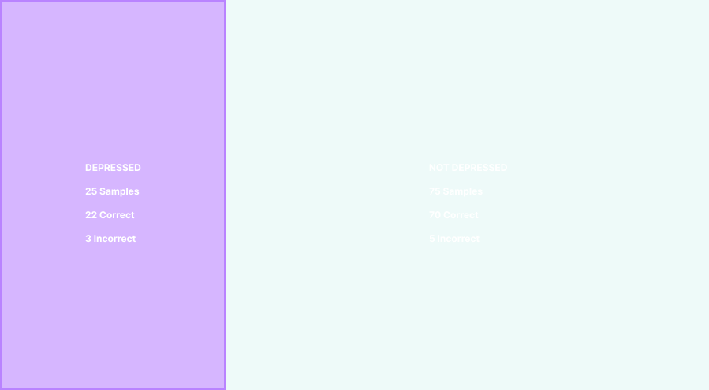
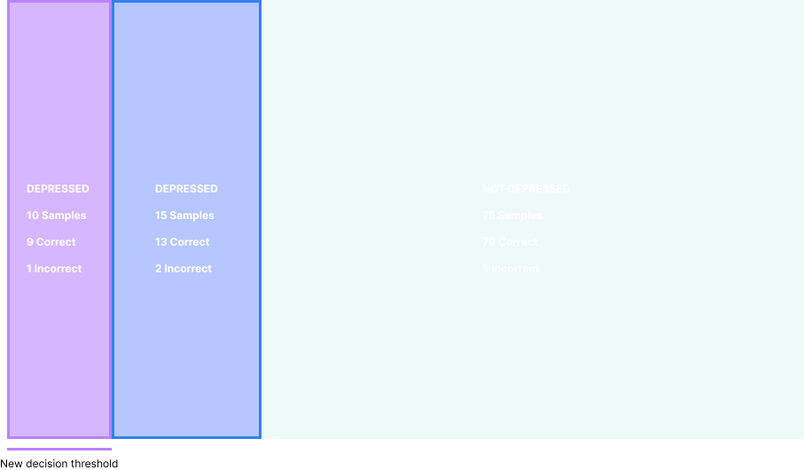
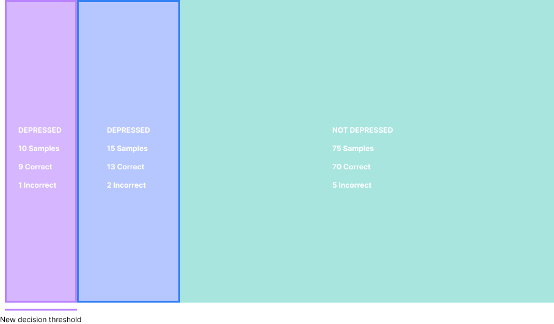
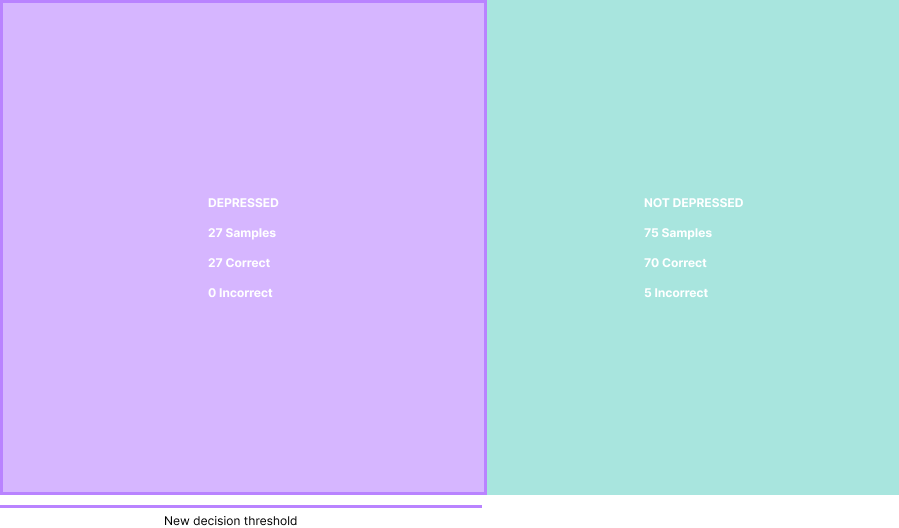

import SubscribeButton from '@site/src/components/blog/subscribe';

---

*This article discusses some basic data science that is required to understand binary classification model outputs.*

<!--truncate-->

In this article we will discuss some basic data-science metrics and terms and use an example dataset to understand how different metrics are calculated with a binary classification model.

Accuracy is just one of many metrics that are important when it comes to creating successful models and this article aims to help simply what metrics matter and what they mean.

- ***this example does not reflect Sahha’s model performance.***
- ***this article is written to help non-data modelling experts learn more about the subject. More in-depth articles will be available soon.***

## Terminology:

**Classification:** This is the category (or label) a model assigns to an observation (or input).

**Label:** Often used synonymously with “class”, label is the variable we wish to predict with the model. E.g., The Sahha binary classifier classifies input data into classes/labels: (depressed, not-depressed)

**Observation:** A data point

**Class imbalance:** Where the class distribution is not equal and is instead skewed.

**True positives:** An outcome where the model correctly predicts the positive class

**True negatives:** An outcome where the model correctly predicts the negative class

**False positives:** An outcome where the model incorrectly predicts the positive class

**False negatives:** An outcome where the model incorrectly predicts the negative class

**Dataset:** A collection of data. For the purposes of Sahha’s model, the dataset used to train and evaluate a model’s performance is a tabular dataset, which is data organised into rows representing observations and columns representing attributes for those observations.

**Accuracy:** The fraction of classifications a model made correctly.

**Recall:** For a given class, recall is the number of correct classifications made for that class divided by the total number of observations that are in that class.

**Precision:** For a given class, precision is the number of correct classifications made for that class divided by the total number of observations the model predicted to be that class.

**Decision threshold:** The tolerance for which the model uses when making a classification based on the predicted probabilities for each class.

Confusing? Let’s understand it all with some examples.

## Example data set

Our example data set will consist of 100 observations. These observations are labeled as either `depressed` or `not-depressed`.

The dataset is imbalanced, in this case, it means that there are more `not-depressed` samples than there are `depressed` samples.

`100 Samples`

`73 not-depressed`

`27 depressed`

## Visualising the data set
The purple area represents the observations that the model classified as depressed, and similarly, the green area represents the observations the model classified as not-depressed.

Within the purple area the data has been classified as such:

- 22 depressed (true positives)

- 3 non-depressed (false positives)

Within the green are the data has been classified as such:

- 70 non-depressed (true negatives)

- 5 depressed (false negatives)

## The model
The model is a binary classification model, in that it only classifies observations as either one of two classes: depressed or not-depressed.

## Determining accuracy
Accuracy is determined by the number of correct classifications, divided by the total number of classifications. In this case, 70 observations are correctly classified as not-depressed plus 22 correctly classified as depressed, this equals 92 correct classifications in total.

The equation is simple, 92/100=0.92
92 correct classifications divided by 100 classifications equals 0.92 or 92%

---

> **Let’s pause, because these next parts are important** when looking at model metrics. Some models have trade-offs between recall and precision. For example, depending on the accuracy performance of the model tightening or loosening the decision threshold of the model will allow you to increase or decrease precision or recall.
>
> What’s a real use-case for this? Let’s say it’s of high importance that your model performs well in identifying correctly classified depressed data-points (true-positives) because you’d rather be certain you have a depressed data-point than perhaps not having one. In this case high precision would be required, potentially sacrificing recall.

---

## Determining recall
First, pick which class you want to calculate the recall on. Let’s use the depressed class for this example (purple outline).

Recall is determined by the number of depressed classifications that were correct divided by the total number of depressed people in the sample.

The equation is simple, 22/27=0.81.

22 correct classifications divided by 27 total depressed classifications equals ~0.81 or approx. 81%.

## Determining precision
First, focus on what class you wish to find the precision for. Let’s again use the depressed class and not consider any of the non-depressed classifications (now faded out.

Precision is determined by the number of depressed classifications that were classed correctly within all of the depressed classifications, divided by the overall number of depressed classifications.

22 correct depressed classifications divided by 25 total depressed classifications equals precision of 0.88.

## Improving precision

Let’s again use the depressed class and not consider the non-depressed classifications.

But this time we need to shrink the decision threshold. After doing so, we’ve reduced
the number of depressed classifications down to just 10. Of which, 9 are correctly classified as depressed and the remaining 1 is not.

Now perform the same equation.

9 correct classifications divided by 10 total depressed classifications equals 0.90.

However, what you’ll notice is that we have ignored 13 correct depressed classifications because of our more strict decision threshold, this has likely changed the recall, or “the precision-recall tradeoff”. Let’s see if that is true.

## What is “the precision-recall tradeoff”?

There is a nice tradeoff between recall and precision. In that, generally, if we want more precision our recall may suffer and visa-versa.

The recall of this model is now calculated as:

10 correct depressed classifications divided by 27 total depressed classification, which equates to ~0.37 or approx. 37%.

## Improving Recall

Now in order to improve recall, we can similarly adjust the decision threshold to accommodate more depressed classifications.

In this model, all depressed classifications have been correctly classified.

27 correct classifications divided by 27 total depressed classifications equals 1 or 100%.

## Conclusion

Hopefully this article helps you understand core binary model metrics, and why they are important to how they perform. Of course the development of these models is much more complicated, we will release an article on this topic in the future.

---

<SubscribeButton />