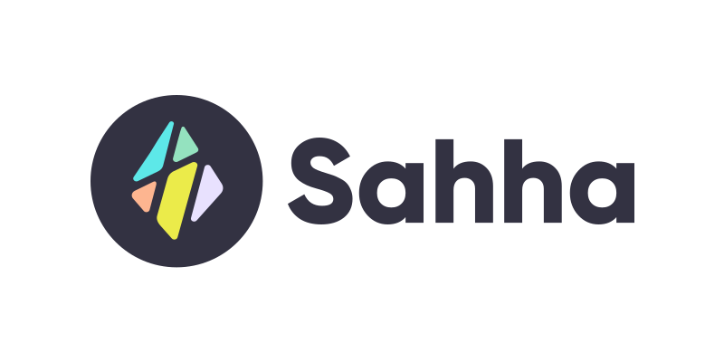

import SubscribeButton from '@site/src/components/blog/subscribe';

---

*Introducing our flagship iOS models and the "Berg Model".*

<!--truncate-->

Sahha’s API predicts psychometric assessments such as the PHQ9, providing an indication of depression risk using a combination of statistical modelling and machine learning. If you want to build on Sahha <u>[you can join here](http://developer.sahha.ai/)</u>.

This data is collected passively using Sahha’s API/SDKs after they are installed into mobile apps.

Once this data is analyzed, it provides an objective assessment of depression risk that can supplement or replace subjective assessments, questionnaires, or surveys.

**This report details our latest models, and their metrics.**

---

## Flagship iOS using HealthKit Step Data
Our first models incorporating step data are trained and live, and they’re our most accurate models to date. Both models use the following data types:

- Step and Sleep data from Apple’s HealthKit, which we provide the tools to record and post to our API in our Sahha SDK

And one model includes:

- Gender and Age demographics

The models are binary classifiers using CatBoost (Gradient Boosted Decision Trees)

The model using all the above data types (Steps, Sleep, Gender and Age) has the following summary metrics (depressed class):

- Sensitivity: 0.767 (+8.02%)

- Specificity: 0.864 (+21.7%)

- Precision: 0.744 (+55.0%)

- F1: 0.755 (+32.4%)

- ROC-AUC: 0.896 (N/A)

- Accuracy: 0.831 (+17.0%)

- Geometric Mean: 0.814 (+14.6%)

- Total Support: 1013 (+24.0%)

And the model using just Steps and Sleep has the following summary metrics:

- Sensitivity: 0.702 (-1.13%)

- Specificity: 0.795 (+12.0%)

- Precision: 0.636 (+32.5%)

- F1: 0.668 (+17.2%)

- ROC-AUC: 0.817 (N/A)

- Accuracy: 0.764 (+7.61%)

- Geometric Mean: 0.747 (+5.21%)

- Total Support: 1053 (+28.9%)

Where percentage improvements are taken from our current flagship model released in Data Science Report 003.

The current best performing Android model is detailed in Data Science Report 003.

## Berg Model
We’re also announcing the releases, and continued development of the “Berg Model” (Alpha) which is a collection of individual models to handle missing data types. The purpose of the Berg Model is such that Sahha can always provide some level of analysis no matter what data is given to us. An example would be if a user didn’t have enough sleep data within the week to qualify for our model using sleep/screen/demos, in this case, the Berg Model would handle this user by providing analysis for them with a model that doesn’t need sleep data.

Currently, the Berg Model is made up of 16 models; one for each unique combination of the data types *{sleep, screen, gender, age}*.

### What’s coming?
- Improved binary classification specificity and sensitivity (on going)

- Multi-class and PHQ9 scoring models

- Android step model

If you have further questions, please reach out to engineering@sahha.ai or join our [Slack Developer Community](https://join.slack.com/t/sahhacommunity/shared_invite/zt-1w0fmfbvk-qUwQ83tJgXyjT9XSxJvKIw).

---

<SubscribeButton />