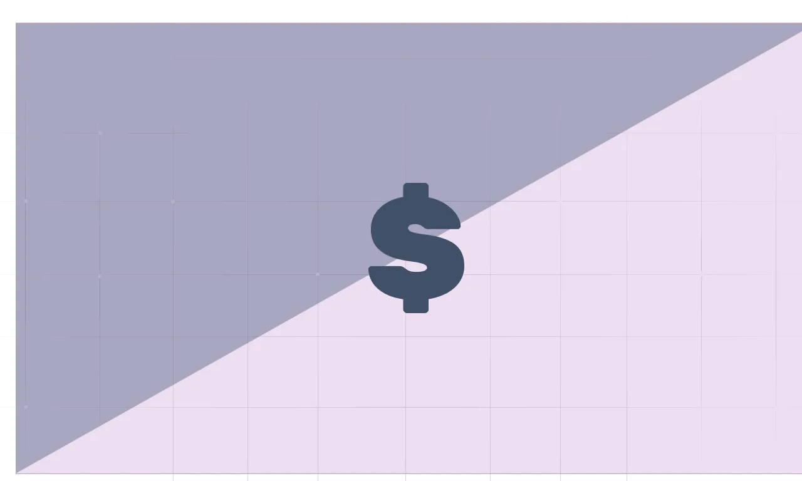

import SubscribeButton from '@site/src/components/blog/subscribe';

---

*Depression is one of the most prevalent mental health issues, with around ~280 million people affected worldwide (World Health Organization, 2021).*

<!--truncate-->

Recent studies have shown that COVID-19 survivors are at an increased risk of developing neurological and psychiatric problems including anxiety and mood disorders (Taquet et al., 2021). A study conducted by Santomauro et al. (2021) found that the high infection rates of COVID-19 and the reduced human mobility were both positively associated with the increase in the prevalence of depressive disorders. Depression is more prevalent in females than in males (World Health Organization, 2021), with this gender gap widening in the depression cases that emerged during the COVID-19 pandemic (Santomauro et al., 2021). Nearly, 50% of the individuals that die of suicide have previously had depression. Further, individuals with depression are 25 times more likely to die by suicide than individuals in the general population (Centre for suicide prevention, 2014). The burden of depression is spread across different domains such as well-being, social, and economic.

## The direct and indirect costs of depression

### 1) To the individual
Living with any mental disorder comes at a great cost to the individual. The disabilities manifested due to the presence of depressive disorders can directly impact an individual’s well-being by influencing an individual's mood, self-esteem, self-confidence, appetite, sleep pattern, and behaviours. These issues can further impact an individual’s interpersonal relationships leading to social withdrawal and lower-levels of adaptive coping (Kinderman et al., 2018), which would also contribute towards a worsening individual well-being. Further, an individual is expected to receive an assessment and treatment for their worsening well-being. The diagnosis and treatment process for depression tend to be financially costly (Okumura & Higuchi, 2011; Thomas & Morris, 2003; Sobocki et al., 2006) for most individuals. The direct medical cost of depression could be costs associated with outpatient care, prescription drugs, and hospitalisations (Okumura & Higuchi, 2011; Thomas & Morris, 2003; Sobocki et al., 2006). For the individual, indirect costs of depression can be costs associated with time-intensive assessment and treatment process. Traditional methods of assessment and treatment of mental disorder requires a one on one meeting between the individual with the clinician. The treatment can last anywhere from 2-12 months (Lin et al., 2006) depending on the type of depressive disorder, type of intervention, severity of the depression, the presence of other comorbid disorders, and/or the presence of any physical medical conditions.

### 2) Suicide-related costs
At its worse, depression can lead to the manifestation of self-harm tendencies, suicidal ideations, failed suicide attempt and suicide in individuals (O’Dea & Tucker, 2005). The direct economic cost of suicide in New Zealand includes the cost of police and fire department involvement, funeral costs, cost of victim support, forensic costs, post-mortems, and inquests. The direct economic cost of suicide attempts are similar as the emergency response teams, ambulance, hospital treatment and emergency department costs are accounted for. The economic cost per suicide attempt and suicide can range anywhere between $3500-$10,000 per person as per the report by Ministry of Health (2005). The indirect costs associated with self-harm, attempted suicide, and suicide to the individual would include the cost poorer wellbeing, lowered life satisfaction, and the cost of life. In the cases of suicide attempts and completed suicide, the loss of production includes the absence of the individual involved, support and/or bearvement days for the immediate friends and family members (O’Dea and Tucker, 2005).

### 3) Workplace-related costs
Additionally, the individual’s burden of depressive disorder also comes with a cost to their workplace and to the society at large. Workplace-related costs increase when an employee or a group of employees are suffering from depression. As individuals with depression tend to have poorer wellbeing and life-satisfaction, these employees are more likely to miss days of work (absenteeism) and are more likely to engage in reduced productivity at work (presenteeism) compared to their non-depressed peers (American Psychiatric Association, 2021). In the US, workplace costs have seen the greatest increase in depression-related costs, more than the cost associated with the direct medical bills and suicide-related costs, increasing from 48% to 61% between 2010-2018 (Greenberg et al., 2021). Estimates have indicated that depression costs upto $24 billion each year to US employers (Steward et al., 2003). In many countries around the world, depression-related workplace costs has been found to largest cost to the economy (Okumura & Higuchi, 2011; Greenberg et al., 2021).

Since depression-related workplace costs comes at the greatest cost to the economy across the globe, it is imperative that employees with depression are screened to improve treatment and intervention outcomes for the individual, further improving the economic outcome of the workplace and the economy at large. It was found that about 60% of the people with major depressive disorder were employed in full-time and part-time positions, people that were employees were more likely to seek treatment for their conditions compared to people that were unemployed (American Psychiatric Association, 2021). Many researchers believe that applying screening and intervention tools in a workplace environment can improve depression management and depression treatment outcomes, which can then positively impact the individual, the workplace, and the society at large (Okumura & Higuchi, 2011; Greenberg et al., 2021; Lerner et al., 2021).

Objective assessment of Depression - a solution?
The burden of depression is shared, however, it can often be treated as the burden of the individual suffering. Taking a holistic approach to recognise how depression can be costly to the individual, their immediate environment (friends and family), their workplace performance, and the society can provide us with a better insight into the urgency of treating depression. Due to the high prevalence rate, severity of disability, and the indirect and direct costs associated with depression, there is a need for better assessment and treatment for the disorder. Effective assessment and treatment of anxiety and depressive disorders can help reduce the burden of these disorders for the individual and for the society at large.

However, current methods of assessment relies heavily on the subjective clinician’s judgement that relies on the criteria of the The Diagnostic and Statistical Manual of Mental Disorders, 5th ed. (DSM-5; American Psychiatric Association, 2013) and/or the International Statistical Classification of Diseases, 10th ed. (ICD-10; World Health Organisation, 2010). As a result, the assessment process can be time-consuming and inaccessible for a lot of the population. Another drawback of relying on subjective measures of diagnosis is that individuals can be misdiagnosed leading to false negative (i.e. individuals with depression tend to not be diagnosed or under-diagnosed) and false positive cases (i.e. individuals without depression tend to be diagnosed incorrectly or over-diagnosed; Klinkman et al., 1998; Vermani et al., 2011; World Health Organization, 2021). Further, barriers to effective mental health care in the form of fewer mental health-care providers, lack of resources, and the social stigma associated with seeking support for mental health concerns could also prompt an individual to not seek support which could further worsen their condition. Therefore, there is a clear need for an objective method of assessment to aid diagnosis.

Digital markers could potentially provide a solution by using machine learning and behavioural data from smartphones and other wearables to predict mental health issues objectively. The ubiquitous nature of smartphones could be used by mental health service providers to passively collect various behavioural data to determine user well-being. Passively data collection minimises the time constraints and inaccessibility issue as the user would not have to actively engage in any activity nor would they have to interact with a clinician. Digital markers could be used as an early-detection assessment method which can be of prime importance to reduce depression-related costs in a workplace setting.

References
American Psychiatric Association. (2013). Diagnostic and statistical manual of mental disorders : DSM-5. American Psychiatric Association.

American Psychiatric Association. (2021). The Economic Cost of Depression is Increasing; Direct Costs are Only a Small Part. https://www.psychiatry.org/News-room/APA-Blogs/The-Economic-Cost-of-Depression-is-Increasing

Center for Suicide Prevention (2014). Depression and Suicide Prevention from https://www.suicideinfo.ca/resource/depression-suicide-prevention/

Greenberg, P. E., Fournier, A. A., Sisitsky, T., Simes, M., Berman, R., Koenigsberg, S. H., & Kessler, R. C. (2021). The economic burden of adults with major depressive disorder in the United States (2010 and 2018). Pharmacoeconomics, 39(6), 653-665.

Kinderman, P., Tai, S., Pontin, E., Schwannauer, M., Jarman, I., & Lisboa, P. (2015). Causal and mediating factors for anxiety, depression and well-being. British Journal of Psychiatry, 206(6), 456-460. doi:10.1192/bjp.bp.114.147553

Klinkman, M. S., Coyne, J. C., Gallo, S., & Schwenk, T. L. (1998). False positives, false negatives, and the validity of the diagnosis of major depression in primary care. Archives of family medicine , 7(5), 451.

Lerner, D., Adler, D., Shayani, A., & Rogers, W. H. (2021). Research on the Tufts be well at work program for employees with depression: 2005–2020. Psychiatric Services , 72(12), 1441-1450.

Lin, E. H., Katon, W., Rutter, C., Simon, G. E., Ludman, E. J., Von Korff, M., ... & Walker, E. (2006). Effects of enhanced depression treatment on diabetes self-care. The Annals of Family Medicine , 4(1), 46-53.

O'Dea D & Tucker S. (2005). The Cost of Suicide to Society. Wellington: Ministry of Health.

Okumura, Y., & Higuchi, T. (2011). Cost of depression among adults in Japan. The primary care companion for CNS disorders , 13(3), 26159.

Santomauro, D. F., Herrera, A. M. M., Shadid, J., Zheng, P., Ashbaugh, C., Pigott, D. M., ... & Ferrari, A. J. (2021). Global prevalence and burden of depressive and anxiety disorders in 204 countries and territories in 2020 due to the COVID-19 pandemic. The Lancet, 398(10312), 1700-1712.

Sobocki, P., Jönsson, B., Angst, J., & Rehnberg, C. (2006). Cost of depression in Europe. Journal of Mental Health Policy and Economics.

Stewart, W. F., Ricci, J. A., Chee, E., Hahn, S. R., & Morganstein, D. (2003). Cost of lost productive work time among US workers with depression. Jama, 289(23), 3135-3144.

Thomas, C. M., & Morris, S. (2003). Cost of depression among adults in England in 2000. The British Journal of Psychiatry , 183(6), 514-519.

Vermani, M., Marcus, M., & Katzman, M. A. (2011). Rates of detection of mood and anxiety disorders in primary care: a descriptive, cross-sectional study. The primary care companion to CNS disorders, 13(2).

World Health Organisation. (2010). International Statistical Classification of Diseases and Related Health Problems 10th Revision from http://apps.who.int/classifications/icd10/browse/2010/en.

World Health Organisation. (2021). Depression. https://www.who.int/news-room/fact-sheets/detail/depression

---

<SubscribeButton />