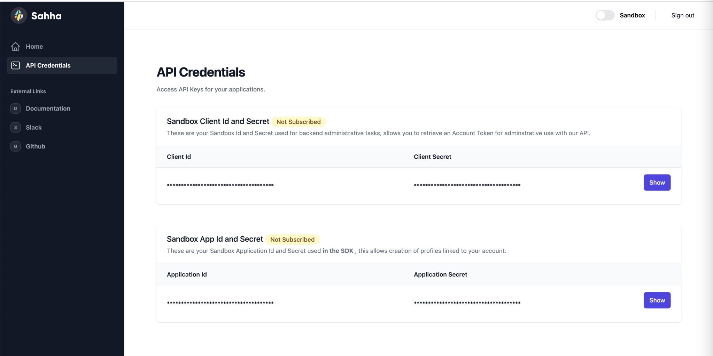

import Tabs from '@theme/Tabs';
import TabItem from '@theme/TabItem';
import Link from '@docusaurus/Link';

# Get Started

This page will help you get started with Sahha. You'll be up and running in a jiffy!

---

## Step 1) Register Your Account

Tap "Register Account" to quickly sign up for an account that your organization can use to access Sahha services.

<Link
            className="button button--secondary button--lg"
            to='https://app.sahha.ai/?rel=docs'>
            Register Account
          </Link>

---

## Step 2) Access Your API Keys

:::info You will need to access your API Keys in order to start connecting to the Sahha API.

You can find your Client ID and Client Secret inside the Dashboard by going to `API Credentials` from the sidebar menu.
:::

---

## Step 3) Start Building

Choose your platform and start building with Sahha!

<Link
            className="button button--secondary button--lg"
            to='/docs/install-the-sdk/ios'>
            iOS
          </Link>

#
<Link
            className="button button--secondary button--lg"
            to='/docs/install-the-sdk/android'>
            Android
          </Link>

#
<Link
            className="button button--secondary button--lg"
            to='docs/install-the-sdk/flutter'>
            Flutter
          </Link>

#
<Link
            className="button button--secondary button--lg"
            to='docs/install-the-sdk/react-native'>
            React Native
          </Link>

***

## Step 5) Join Sahha on Slack

Sahha hosts an open Slack community for developers. Please join us on Slack to get help from the Sahha team and fellow developers to better integrate Sahha into your project.

<Link
            className="button button--secondary button--lg"
            to='https://join.slack.com/t/sahhacommunity/shared_invite/zt-1w0fmfbvk-qUwQ83tJgXyjT9XSxJvKIw'>
            Join Sahha on Slack
          </Link>