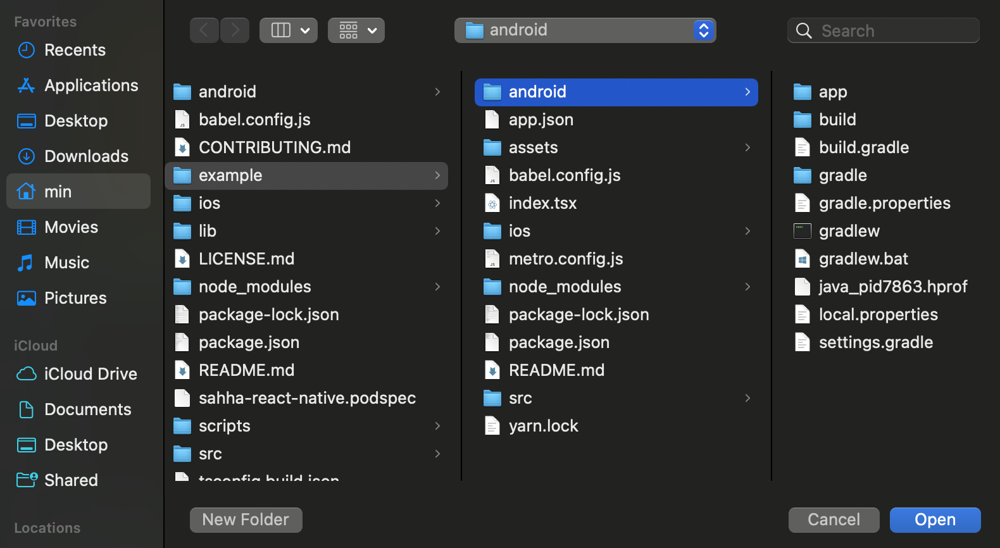
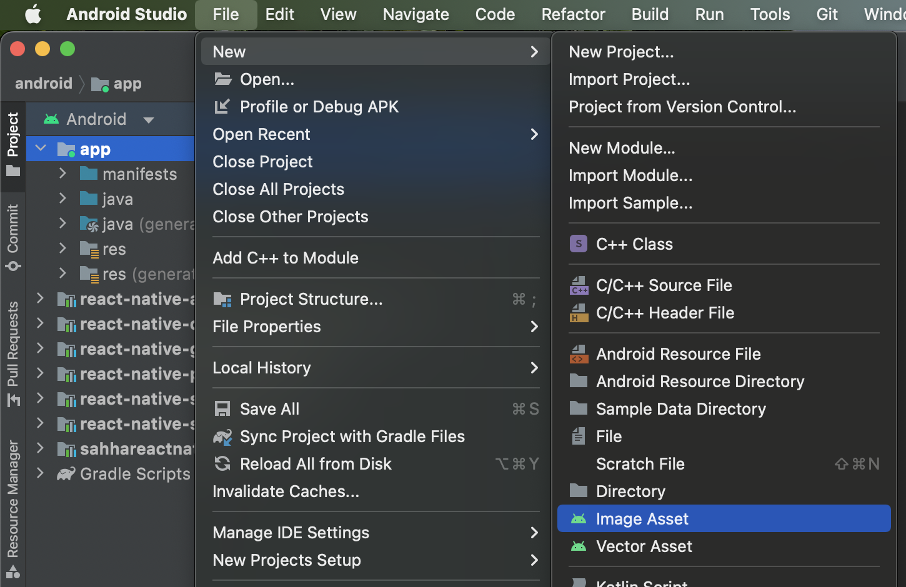
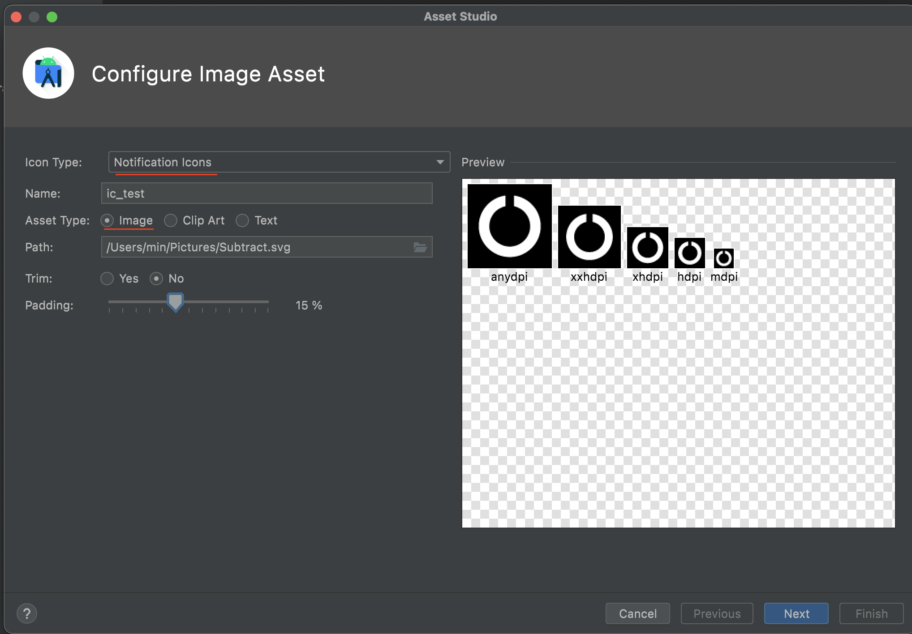
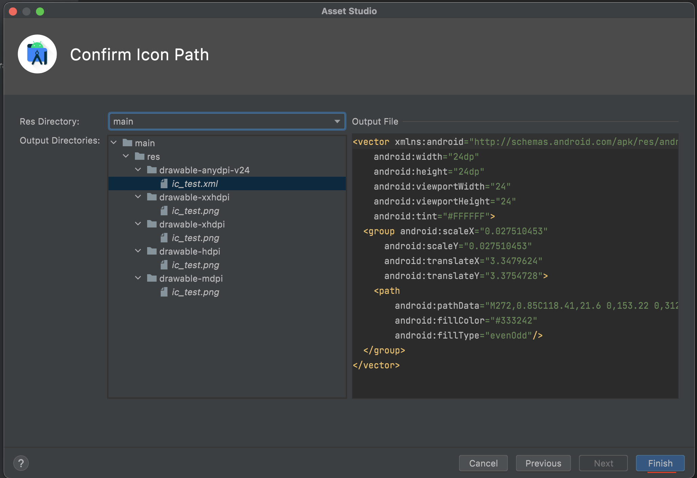

import Tabs from '@theme/Tabs';
import TabItem from '@theme/TabItem';

# Configuration

You will need to configure the Sahha SDK before you can use it.

:::caution Configure the SDK immediately

The Sahha SDK must be configured immediately on app launch.

:::

---

## Configure

Choose your specific platform from the options below.

<Tabs groupId="os">

<TabItem value="ios" label="iOS (SwiftUI)">

```swift title=MyApp.swift
import SwiftUI
// highlight-next-line
import Sahha

@main
struct MyApp: App {

  // highlight-next-line
  // Configure Sahha inside `init` of your app's `App` view.
    
  init() {
    // highlight-start
    let settings = SahhaSettings(environment: .sandbox)
    Sahha.configure(settings) {
      // SDK is ready to use
      print("SDK Ready")
    }
    // highlight-end
  }

  var body: some Scene {
    WindowGroup {
      ContentView()
    }
  }
    
}
```

</TabItem>

<TabItem value="ios-uikit" label="iOS (UIKit)">

```swift title=AppDelegate.swift

import UIKit
// highlight-next-line
import Sahha

@main
class AppDelegate: UIResponder, UIApplicationDelegate {

// highlight-next-line
// Configure Sahha inside `application didFinishLaunchingWithOptions` of your app's `AppDelegate`.

  func application(_: UIApplication, didFinishLaunchingWithOptions _: [UIApplication.LaunchOptionsKey: Any]? = nil) -> Bool {
  // highlight-start
    let settings = SahhaSettings(
      environment: .sandbox, // Required - .sandbox for testing
      sensors: [.sleep] // Optional - defaults to all sensors
    )
    Sahha.configure(settings) {
      // SDK is ready to use
      print("SDK Ready")
    }
    // highlight-end
    return true
  }

}
```

</TabItem>

<TabItem value="android" label="Android">

```kotlin title=MainActivity.kt

// highlight-next-line
import sdk.sahha.android.source.*

// highlight-next-line
// Configure Sahha inside `onCreate` of your app's `MainActivity`.

class MainActivity : ComponentActivity() {

    override fun onCreate(savedInstanceState: Bundle?) {
        super.onCreate(savedInstanceState)

// highlight-start
        // You can specify optional custom notification settings
        val notificationSettings = SahhaNotificationConfiguration(
            icon = R.drawable.ic_test, // The icon id must match the filename you add to the project
            title = "Custom Title",
            shortDescription = "Custom description",
        )

        val settings = SahhaSettings (
            environment = SahhaEnvironment.sandbox,
            notificationSettings = notificationSettings, // Optional - defaults to null
            sensors = [.pedometer, .sleep], // Optional - defaults to all avaialable sensors
        )

        Sahha.configure(application, settings) { error, success ->
            if (error != null) {
                println(error)
            } else {
                println(success.toString())
            }
        }
        // highlight-end
    }
}
```

</TabItem>

<TabItem value="flutter" label="Flutter">

```dart title=MyApp.dart

// highlight-next-line
import 'package:sahha_flutter/sahha_flutter.dart';


class _MyAppState extends State<MyApp> {

  @override
  void initState() {
    super.initState();

    // highlight-start
    // Configure Sahha inside `initState` of your app's `AppState`.

    // Optional - Android only
    var notificationSettings = {
      'icon': 'Custom Icon',
      'title': 'Custom Title',
      'shortDescription': 'Custom Description'
    };

    // Use custom values
    SahhaFlutter.configure(
      environment: SahhaEnvironment.sandbox, // Required - .sandbox for testing
      sensors: [SahhaSensor.device] // Optional - defaults to all sensors
    .then((success) => {
      debugPrint(success.toString())
    })
    .catchError((error, stackTrace) => {
      debugPrint(error.toString())
    });

    // highlight-end
  }
}
```

</TabItem>

<TabItem value="react-native" label="React Native">

```typescript title=MyApp.tsx

import React, { useEffect } from 'react';
// highlight-next-line
import Sahha, { SahhaEnvironment, SahhaSensor } from "sahha-react-native";

export default function App() {

   useEffect(() => {

// highlight-start
    // Configure Sahha inside the `useEffect` of your App's `export function`.

    // Use custom values
    const settings = {
      environment: SahhaEnvironment.sandbox, // Required -  .sandbox for testing
      // Optional - Android only
      notificationSettings: {
        icon: "ic_test",
        title: "Test Title",
        shortDescription: "Test description.",
      },
      sensors: [SahhaSensor.sleep, SahhaSensor.pedometer], // Optional - defaults to all sensors
    };

    Sahha.configure(settings, (error: string, success: boolean) => {
      console.log(`Success: ${success}`);
      if (error) {
        console.error(`Error: ${error}`);
      }
    });
  // highlight-end

  }, []);

}
```

</TabItem>

</Tabs>

## Environment Settings

The `SahhaEnvironment` determines if the SDK connects to the `sandbox` or `production` server of the API. 

| SahhaEnvironment | Description                     |
| ---------------- | ------------------------------- |
| sandbox          | For testing and debugging |
| production       | For public release on the App Store / Google Play |

:::danger Setting the incorrect environment will send data to the wrong server!

- **Always** use `sandbox` during development of your app.
- **Only** use `production` when releasing your app to public users *(not for internal testing)*.

:::

<Tabs groupId="os">

<TabItem value="ios" label="iOS">

```swift
public enum SahhaEnvironment: String {
    case sandbox
    case production
}
```

</TabItem>

<TabItem value="android" label="Android">

```kotlin
enum class SahhaEnvironment {
    sandbox,
    production
}
```

</TabItem>

<TabItem value="flutter" label="Flutter">

```dart
enum SahhaEnvironment {
  sandbox,
  production
}
```

</TabItem>

<TabItem value="react-native" label="React Native">

```typescript
enum SahhaEnvironment {
  sandbox,
  production
}
```

</TabItem>

</Tabs>

---

## Sensor Settings

You can specify which sensors for the Sahha SDK to use. To optimize your analysis result, we suggest enabling all sensors. Leave this value null to enable all sensors by default.

**Some sensors are not available on all platforms.**

| SahhaSensor | Description                                     | Android | iOS |
| ----------- | ----------------------------------------------- | :-----: | :-: |
| sleep       | For tracking sleep patterns                     |    ✓    |  ✓  |
| pedometer   | For tracking walking patterns                   |    ✓    |  ✓  |
| device      | For tracking device usage patterns              |    ✓    |  X  |
| heart       | For tracking heart patterns (rate, variability) |    X    |  ✓  |
| blood       | For tracking blood patterns (pressure, glucose) |    X    |  ✓  |

<Tabs groupId="os">

<TabItem value="ios" label="iOS">

```swift
public enum SahhaSensor: String, CaseIterable {
    case sleep
    case pedometer
    case device
    case heart
    case blood
}
```

</TabItem>

<TabItem value="android" label="Android">

```kotlin
enum class SahhaSensor {
    device,
    sleep,
    pedometer,
    heart,
    blod
}
```

</TabItem>

<TabItem value="flutter" label="Flutter">

```dart
enum SahhaSensor {
  sleep,
  pedometer,
  device,
  heart,
  blood
}
```

</TabItem>

<TabItem value="react-native" label="React Native">

```typescript
enum SahhaSensor {
  sleep,
  pedometer,
  device,
  heart,
  blood
}
```

</TabItem>

</Tabs>

---

## Notifications

You can customize notifications for any platform that includes an Android app.

:::tip You can customize notifications for the following platforms:
 
- [x] Android
- [x] Flutter (Android only)
- [x] React Native (Android only)

_**iOS apps not supported**_

:::

***

### Custom Notification Icon

You can add an optional custom notification icon to your Android app.

:::info How to create app icons with Image Asset Studio

[Click here for more info](https://developer.android.com/studio/write/image-asset-studio#image)

:::

#### Step 1) Open your project in Android Studio.



#### Step 2) With the app folder highlighted, select`File` → `New` → `Image Asset`.



#### Step 3) Select `Notification Icons` for `Icon Type`, enter a `Name`, select `Image` as `Asset Type` and alter the `Padding` as desired.



#### Step 4) This page can typically be left as it is. Select `Finish`.



***

### Custom Notification Settings

You can specify optional custom `notificationSettings`. If `notificationSettings` are not specified, then the app will use the default notification settings.

```kotlin title=Android
val notificationSettings = SahhaNotificationConfiguration(
    icon = R.drawable.ic_test, // The icon id must match the filename you add to the project
    title = "Custom Title",
    shortDescription = "Custom description",
)
```

***

### Default Notification Settings

If custom `notificationSettings` are not specified, then the app will use the default notification settings. If custom `notificationSettings` are only partially specified, then the app will use the default notification settings.The app will fill in the missing notification parameters with default values. E.g. if an `icon` and `title` are provided but a `shortDescription` is not, then the `shortDescription` will use the default value.

```kotlin title=Android
val icon = R.drawable.ic_sahha_no_bg // The Sahha logo
val title = "Analytics are running"
val shortDescription = "Swipe for options to hide this notification."
```